# Neural Network Charity Analysis

## Introduction

Over the past 20 years Alphabet Soup has donated over 10 Billion to different agencies. Some of the money donated went to helping develop life saving technology. Some of the money donated went to climate efforts like forest reforestation. Alphabet Soup's president, Andy Glad, has asked Beks to review the avaiable data and try to help develop a way to determine if an agency is valid and the money donated from Alphabet Soup will be properly utilized.   

From Alphabet Soup’s business team, Beks received a CSV containing more than 34,000 organizations that have received funding from Alphabet Soup over the years. Within this dataset are a number of columns that capture metadata about each organization, such as the following:

- EIN and NAME—Identification columns
- APPLICATION_TYPE—Alphabet Soup application type
- AFFILIATION—Affiliated sector of industry
- CLASSIFICATION—Government organization classification
- USE_CASE—Use case for funding
- ORGANIZATION—Organization type
- STATUS—Active status
- INCOME_AMT—Income classification
- SPECIAL_CONSIDERATIONS—Special consideration for application
- ASK_AMT—Funding amount requested
- IS_SUCCESSFUL—Was the money used effectively

## Analysis of dataset

### Preparing the data

The first step to preparing the data is to read the data in from the CSV file we were provided, and get it loaded  into a dataframe.

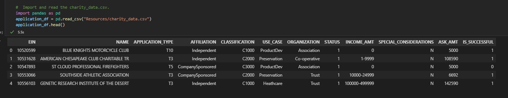

After looking at our dataset we determine that two columns are not features or target, these columns need to be removed. So the next step is to start the cleansing by removing data columns which are not necessary or important to the analysis. In the case of this dataset we drop the two columns, EIN and NAME, which are identifier columns.

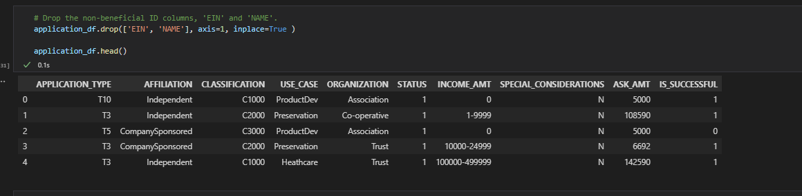

The next step is to identify the target of the model. In theis dataset the target is identified as the IsSuccessful column.

The next step is to identify the features of the dataset so they can be prepared for encoding. In this dataset the features are:

- APPLICATION_TYPE—Alphabet Soup application type
- AFFILIATION—Affiliated sector of industry
- CLASSIFICATION—Government organization classification
- USE_CASE—Use case for funding
- ORGANIZATION—Organization type
- STATUS—Active status
- INCOME_AMT—Income classification
- SPECIAL_CONSIDERATIONS—Special consideration for application
- ASK_AMT—Funding amount requested

The next step of the data prep is to encode the string data into usable values, 1 or 0.  The encoding process produces a dataset which looks like:
 
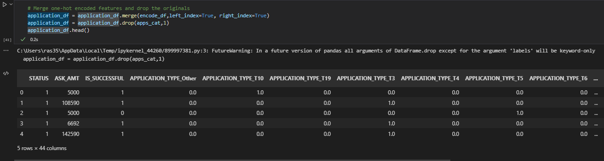

Now that we have cleansed dataset, we are ready to start building our neural network and start the analysis process. We setup our first network with the following parameters:

<table>
<tr>
<th>Layer</th>
<th>Nodes</th>
<th>Activation</th>
</tr>
<tr>
<td>1</td>
<td>10</td>
<td>relu</td>
</tr>
<tr>
<td>2</td>
<td>5</td>
<td>relu</td>
</tr>
<tr>
<td>output</td>
<td></td>
<td>sigmoid</td>
</tr>
</table>

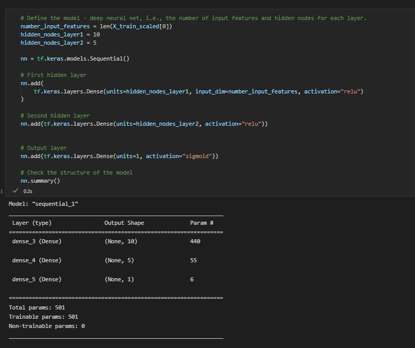

After training this model by running it through 100 epochs, the model showed an accuracy of 72.45%. 

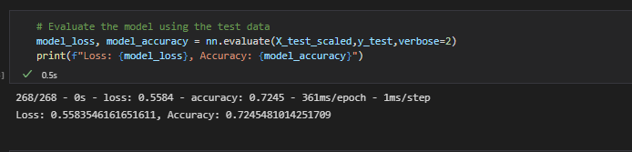

While 72.45% is not a bad rate of accuracy, it is not good enough for our purposes. So we decided to rebuild the model and try to optimize it in different ways to see if we could improve the accuracy.

## Optimization Attempts

The first attempt of optimization for the model was to try to utilize the same model but with larger number of nodes for the two hidden layers.

<table>
<tr>
<th>Layer</th>
<th>Nodes</th>
<th>Activation</th>
</tr>
<tr>
<td>1</td>
<td>20</td>
<td>relu</td>
</tr>
<tr>
<td>2</td>
<td>10</td>
<td>relu</td>
</tr>
<tr>
<td>output</td>
<td></td>
<td>sigmoid</td>
</tr>
</table>

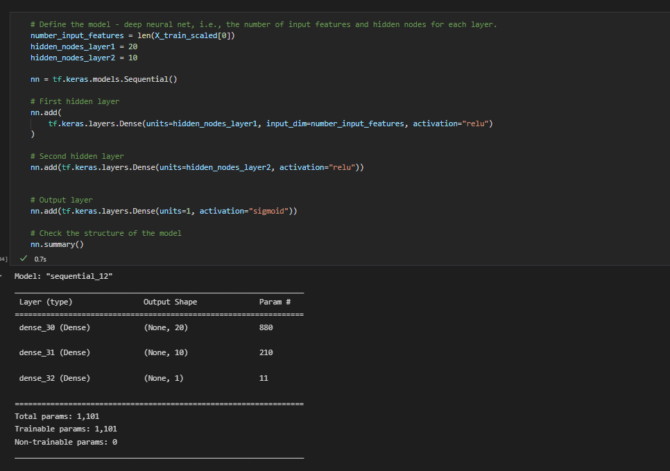

After training this model by running it through 100 epochs, the model showed an accuracy of 72.65%. A small improvement, but no where near the kind of improvement we need to utilize the model.

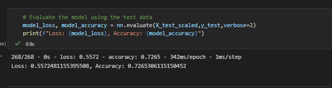

The second attempt of optimization for the model was to try to utilize the same model but with new activations for the two hidden layers.

<table>
<tr>
<th>Layer</th>
<th>Nodes</th>
<th>Activation</th>
</tr>
<tr>
<td>1</td>
<td>20</td>
<td>tanh</td>
</tr>
<tr>
<td>2</td>
<td>10</td>
<td>tanh</td>
</tr>
<tr>
<td>output</td>
<td></td>
<td>sigmoid</td>
</tr>
</table>

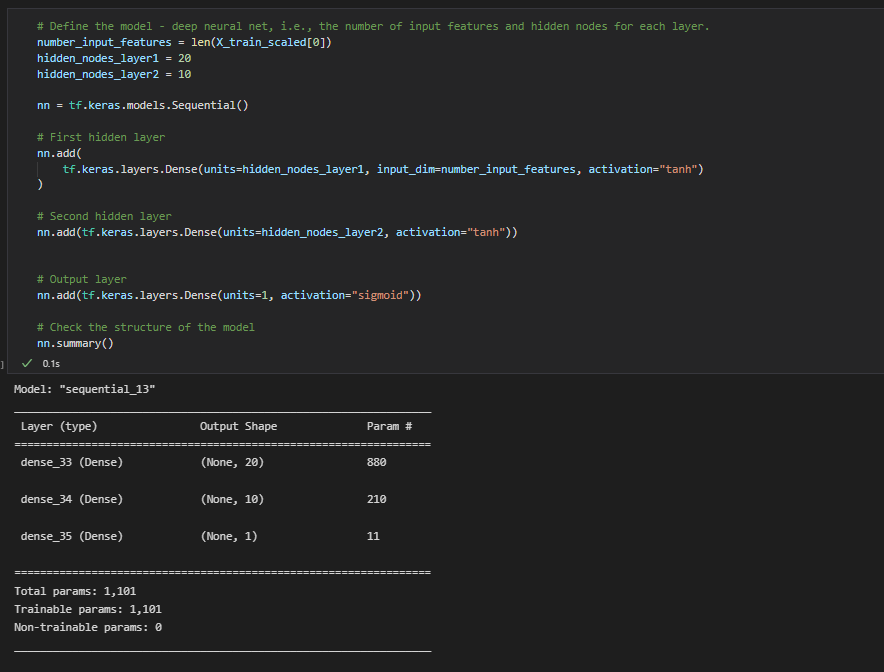

After training this model by running it through 100 epochs, the model showed an accuracy of 72.47%. A small decrease in accuracy. Better than the original marginally, but not better than just adding nodes to the original. This is obviously not the accuracy we need to utilize the model.

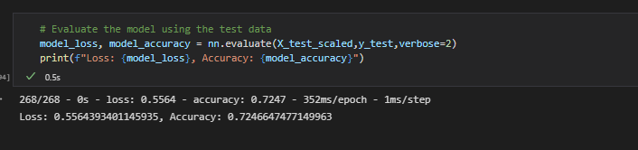

The second attempt of optimization for the model was to try to utilize the same model but with new activations for the two hidden layers.

<table>
<tr>
<th>Layer</th>
<th>Nodes</th>
<th>Activation</th>
</tr>
<tr>
<td>1</td>
<td>20</td>
<td>sigmoid</td>
</tr>
<tr>
<td>2</td>
<td>10</td>
<td>sigmoid</td>
</tr>
<tr>
<td>output</td>
<td></td>
<td>sigmoid</td>
</tr>
</table>

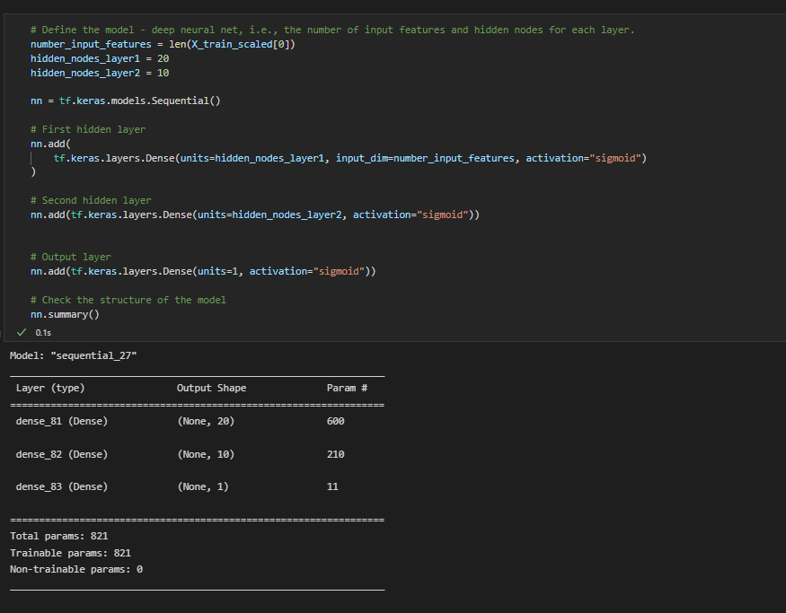

After training this model by running it through 100 epochs, the model showed an accuracy of 72.03%. A small decrease in accuracy. This model is the least accurate model so far, and is obviously not the accuracy we need to utilize the model.

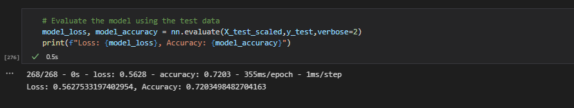

## Total Model Overhaul

We decided we need to try make some larger changes to see if we could raise the accuracy of our model. So we completely started over in the process. The first step to preparing the data is to read the data in from the CSV file we were provided, and get it loaded into a dataframe.

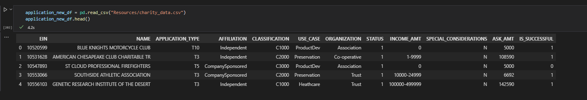

The next step is to start the cleansing by removing data columns which are not necessary or important to the analysis. In the case of this dataset we dropped four columns to make the dataset smaller and possibly less confusing to the model. We dropped
<ul>
<li> EIN - which is an identifier column</li>
<li> NAME - which are identifier column</li>
<li> INCOME AMT - Amount of income identified for the charity</li>
<li> USE_CASE - Use case identified for the grant</li>
</ul>

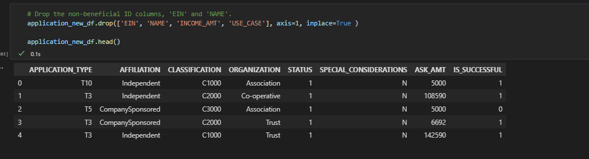

The next step of the data prep is to encode the string data into usable values, 1 or 0.  The encoding process produces a dataset which looks like:

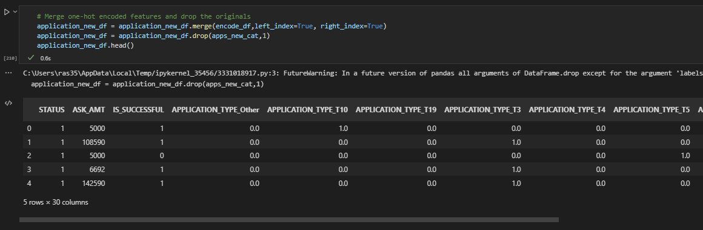

With the new dataset, we decided to try changing th model as well. This attempt of optimization for the model was to try to utilize a three layer model with a mix of activation types.

<table>
<tr>
<th>Layer</th>
<th>Nodes</th>
<th>Activation</th>
</tr>
<tr>
<td>1</td>
<td>20</td>
<td>relu</td>
</tr>
<tr>
<td>2</td>
<td>10</td>
<td>relu</td>
</tr>
<tr>
<td>3</td>
<td>5</td>
<td>sigmoid</td>
</tr>
<tr>
<td>output</td>
<td></td>
<td>sigmoid</td>
</tr>
</table>

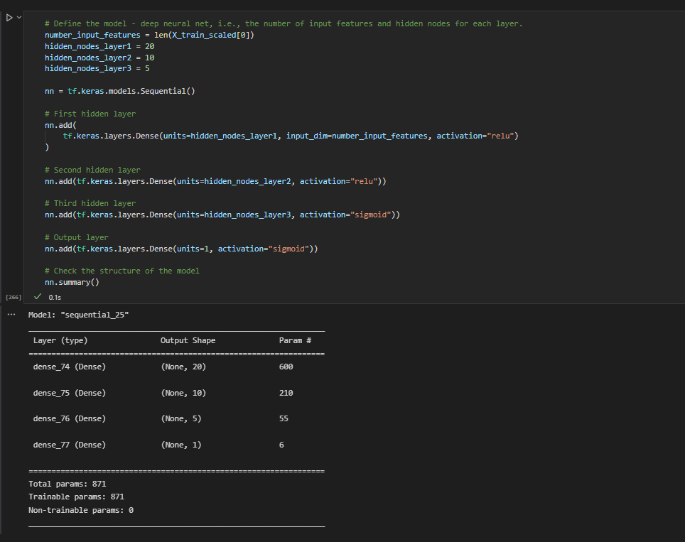

After training this model by running it through 100 epochs, the model showed an accuracy of 72.13%. A small decrease in accuracy. This model is nearly the least accurate model so far, and is obviously not the accuracy we need to utilize the model.

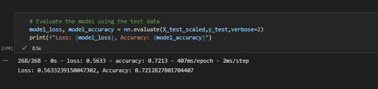

## Final Thoughts

After trying multiple iterations of different combinations of the following:
<ul>
<li>activation types</li>
<li>output types</li>
<li>number of nodes per layer</li>
<li>number of hidden layers</li>
</ul>

Our accuracy didn't change much it was always between 72.0% and roughly 73.2%. None of these models were up to the specified accuracy requested by Andy Glad the company president. We will have to provide him a report stating we couldn't get to the requested level and that the dataset does not seem to support the ability to differentiate  records enough to make an accurate model to the level of accuracy requested.    

## Recommendations

We have two choice to try to reach the requested accuracry level

<ol>
	<li>Work on the current neural network</li>
	<li>Utilize a more suitable method of analysis</li>
</ol>
If we were decide to try to utilize the current neural network to solve this problem, to reach the requested accuracy level we would have to try two things:
<ol>
	<li>Try to add to the dataset to help differentiate the records better</li>
	<ul>
		<li>Data analysis need to be done on the source system to determine if there are any other data columns avaiable, and if they can help identify if a charity is valid or not</li>
		<li>Data analysis needs to be done on any supplementry systems which could provide any clues on whether the charity is valid or not</li>
		<li>Outside data about the charity should be considered for addition to the dataset</li>
	</ul>
	<li>work on trying some more permutations of the model build</li>
	<ul>
		<li>Try new combinations of the activation types</li>
		<li>Try more traing iterations say 500 or 1000</li>
		<li>Try more nodes in our hidden layers say 50 for the first layer</li>
		<li>We tried three layers, we could up that to say six layers</li>
	</ul>
</ol>

This problem is not unsolvable, it just will take some work and experimentation on both the data side, and on the modeling side to help achieve the requested accuracy level.

The other way to solve this problem, is to utilize another model type which might fit the data better. The two other types that seem to fit this problem better are:
<ul>
	<li>Logistic regression</li>
	<li>Decision Tree</li>
</ul>

This is a categorization problem, is the donation to the charity successful or not. These two types of models help with a problem like we are researching, Yes/No. I personally would lean towards the decision tree. It could build decision nodes based on many of the features in the dataset and help determine the target better. Unless you knew that there was more data available for abnalysis to try for the first option. It makes sense to try to a simler categorical model, like a decision tree, for this dataset.
